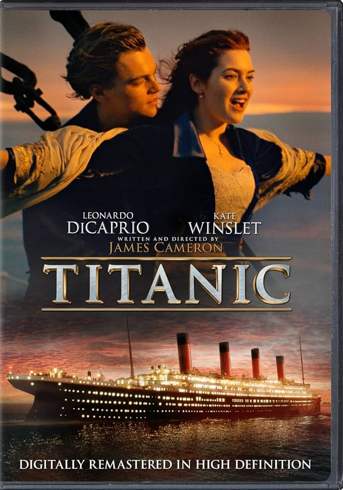

# How to achieve glory and success as a filmmaker

## Datastory

A movie producer comes to see us and says he wants to make a successful movie in a given genre and for a given geographical area, between USA, America, Africa, Europe, Asia or Oceania. He wants to find the best drivers that will make his movie a success, both financially by making substantial box office profits, and critically by getting good ratings and reviews. We decided to create an easy-to-use interface where the producer can select his genre and target market parameters and get feedback on the optimization of multiple parameters such as runtime, director profile, actor profiles, main language, and potentially plot and character persona elements in order to achieve his goal. 

## ALINE : AJOUTER LES ANALYSES GENERALES 

### Idées de questions:
- What is the relation between revenues and being awarded?
- Does the cast influence the gender, the revenue amount and the rating?
- Which genre is more nominated/rewarded?
Mettre des mauvais graphes en plotly et des vilaines analyses

### Causal analysis of observational data : sensitivity analysis : nominated, oscar, rating --> profitability ?? 

**BENOIT**

## Explore each main genres 

For each genre we explore different questions:

- Which genre is more represented according to a location? Which genre performs better according to a location?
- How do rating and revenue vary as a function of the genre?
- What is the relationship between ratings and revenues?
- What is the optimal runtime for each genre?
- Which relation between the screen time and the opportunity to win an award ?

[Click here for Drama](/drama) | [Click here for Family](/family) | [Click here for Action & Adventure](/action_adventure) | [Click here for Fiction](/fiction) | [Click here for Horror](/horror)

  
  
  
  
  

## Abstract

When you arrive on the interface, you can choose the genre of the film you want to make, as well as the location where it will be released. We will give you some tips to make sure you produce a great movie.
To determine these parameters, we search for links among similar successful films. We then need to define whether a film is a success or not. In order to do that, we give a score based on awards (Oscars, nominations...), ratings and profits. 
We will then answer a series of scientific questions that will help us identify the components needed to make a good film.

## Additional datasets

As we are computing a success rating for each movie, we need to take into account the reviews, the inflation adjusted profits to be able to compare the profitability of each movie and the Oscars nominations and awards. This data is not available in the provided datasets. We use these additional datasets in order to get them:

- Database online: [IMDb free database](https://developer.imdb.com/non-commercial-datasets/) 
- Data scrapping of IMDb reviews (if we have time): [IMDb scores](exploration/IMDb_scrapping_v1.ipynb)
- Data for movie budgets : [TMDB dataset](https://www.kaggle.com/datasets/kakarlaramcharan/tmdb-data-0920)
- Oscars nominations and wins dataset : [Oscars](https://www.kaggle.com/datasets/pushpakhinglaspure/oscar-dataset)
- Dataset used to compute inflation adjusted profits : [US inflation data](https://www.kaggle.com/datasets/varpit94/us-inflation-data-updated-till-may-2021)

## Additional ideas

These are some ideas that we wanted to implement, but we need more ressources and time.
- Extract sentiment analysis score of a movie from plot.
- Extract sentiment score of movie reviews and tweets.
- Multiple analysis on the Stanford CoreNLP dataset.

## BAVMA Research Team

This projects takes place in the context of the ADA 2023 course at EPFL Lausanne.

The team members are : 

- Aline
- Benoît
- Valentin
- Mathieu
- Antoine

